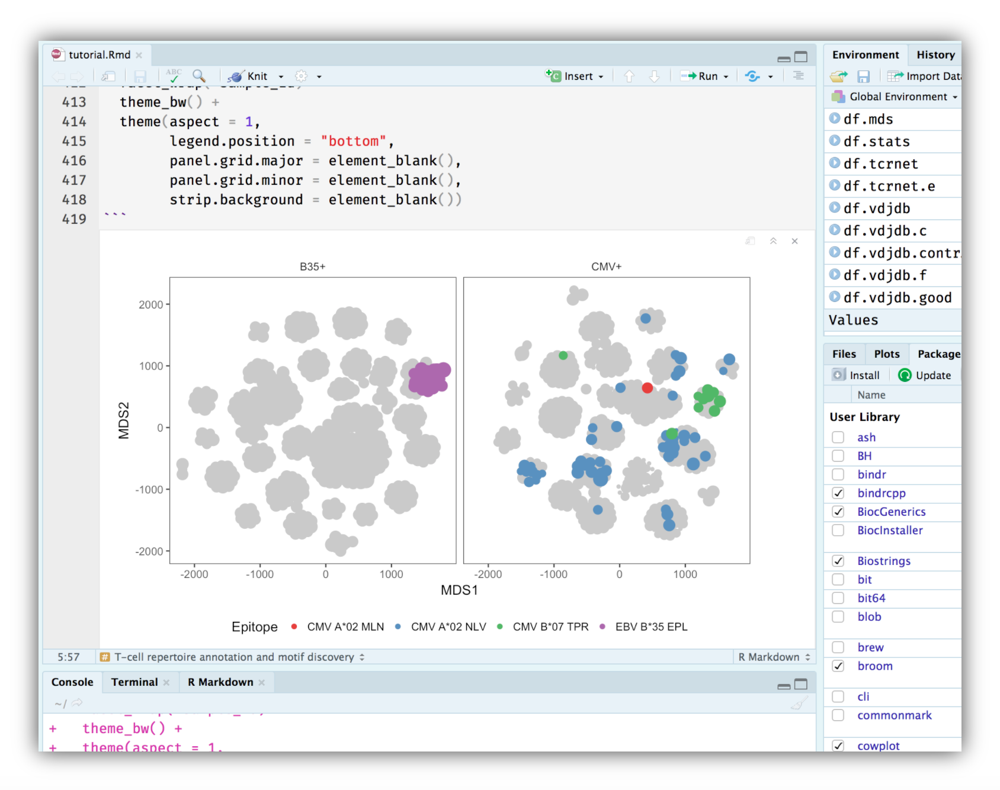

[](https://creativecommons.org/licenses/by-sa/4.0/)

## **T-cell repertoire annotation and motif discovery** tutorial

This tutorial provides a basic introduction to the inference of T-cells specific to certain epitopes and T-cell receptor sequence motif extraction from high-throughput sequencing data (RepSeq). The users will get familiar with [VDJdb](https://github.com/antigenomics/vdjdb-db) and [VDJtools](https://github.com/mikessh/vdjtools) software and learn some tricks for working with TCR sequences and TCR sequence motifs in R.



### Prerequisites

The following software is required to run the tutorial:

* **Java v1.10** Can be downloaded from [Java SE Runtime Environment 10 Downloads](https://www.oracle.com/technetwork/java/javase/downloads/jre10-downloads-4417026.html) or installed by other means.

* **RStudio** Can be installed from [rstudio.com](https://www.rstudio.com).

* **R packages** Run the following command in RStudio:

```R
install.packages(c(
	"dplyr", "data.table", "ggplot2",
	"forcats", "parallel", "stringr",
	"reshape2", "igraph", "msa",
	"stringdist", "broom", "GGally",
	"ggseqlogo", "network", "gridExtra",
	"cowplot"
	)
)
```

or install these packages manually.

Download the tutorial by clicking the ``Clone or download`` button above or execute

```bash
git clone https://github.com/antigenomics/sciar-tutorial-2018.git
```

### Materials

The slides can be found in ``slides/slides.pdf``. For the interactive part open the ``tutorial.Rmd`` file in RStudio.